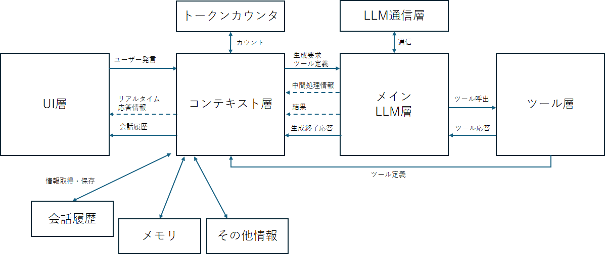

# Context Workshop
C#で、LLMのコンテキスト管理を作り込むための実験プロジェクト。

従来の開発がどうにもぐちゃぐちゃになるため、インターフェースで明確に層を分けている。

## メモ
+ 会話履歴をシステムプロンプトに詰め込んでいるのは意図的 (この方が自由度が高く管理しやすいため)
+ とりあえずの会話履歴の永続化、画像添付、ツール、MCP、ファクト抽出などの雑多な機能を実装してある。
+ 会話履歴の切り捨てや圧縮などの機能はまだ実装していない。(これを実験するためのリポジトリである)
